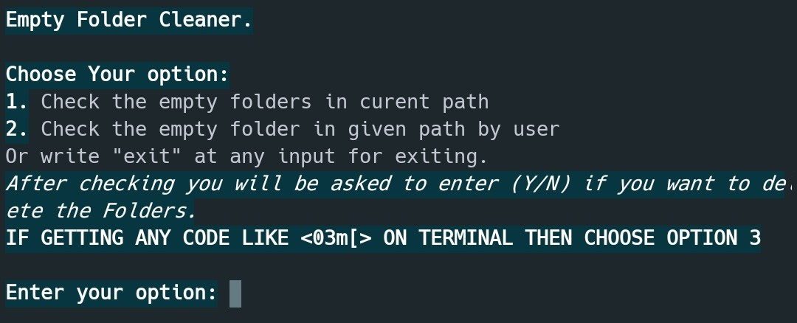
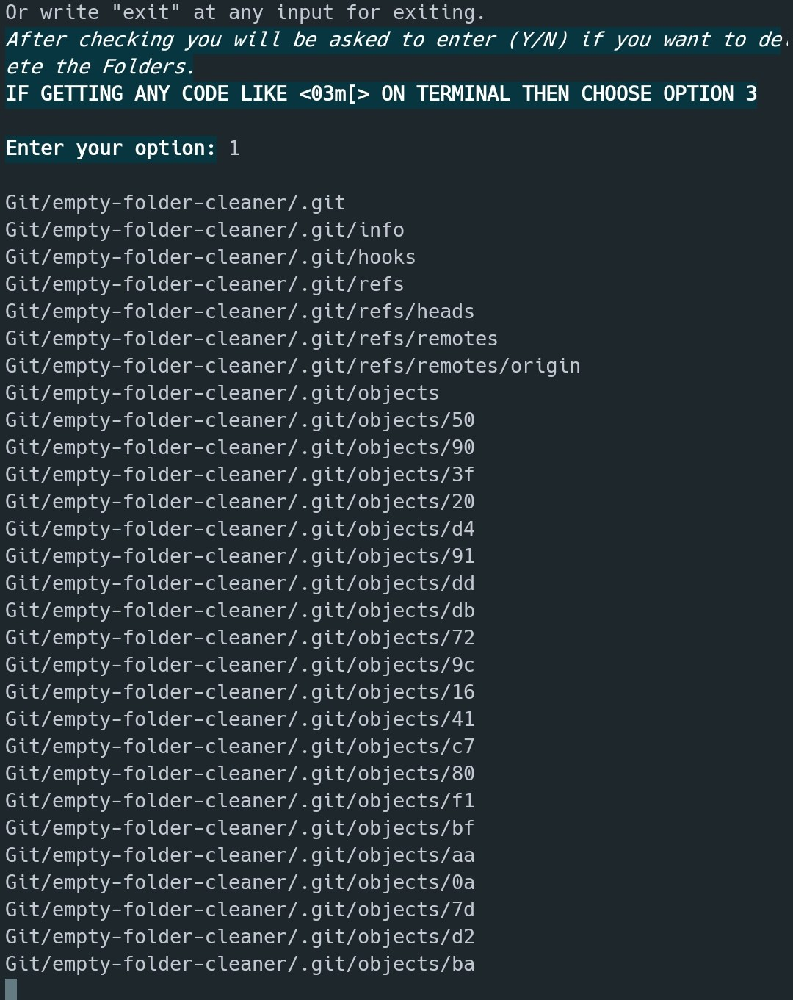
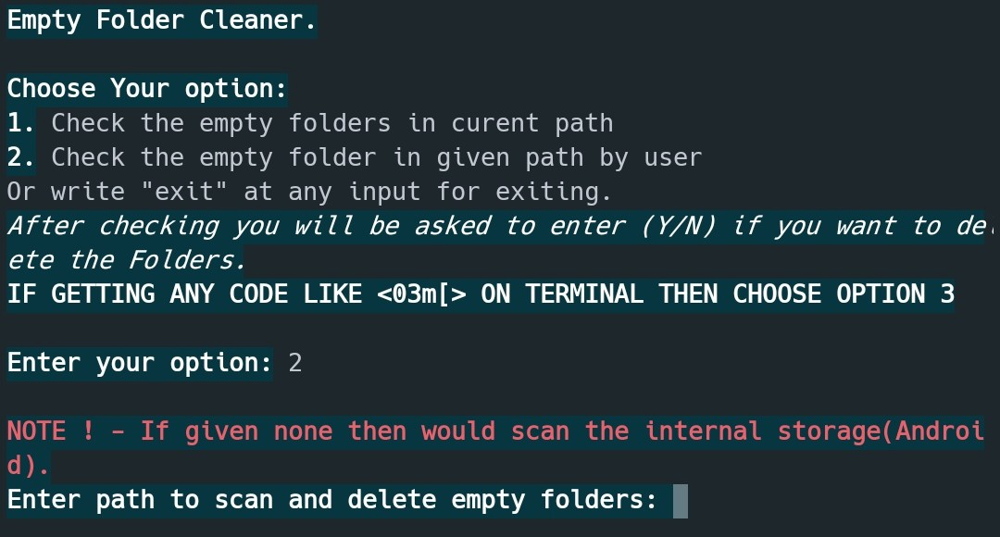
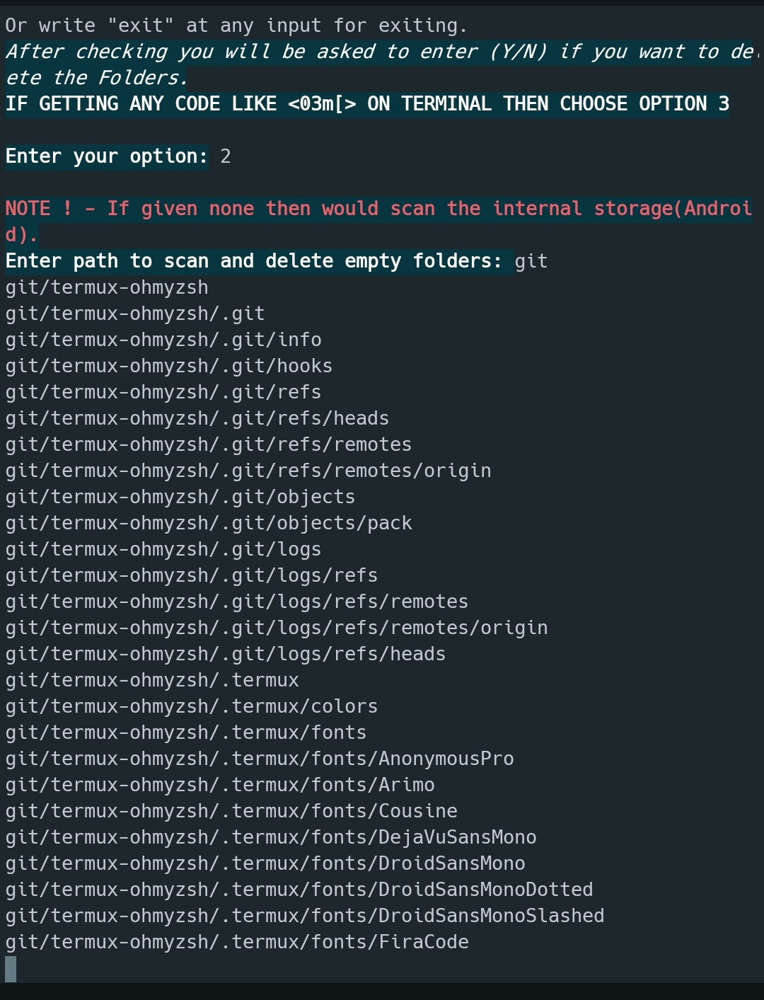
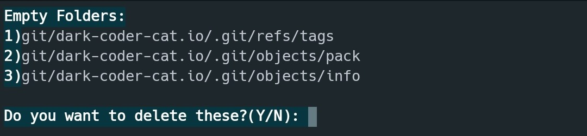
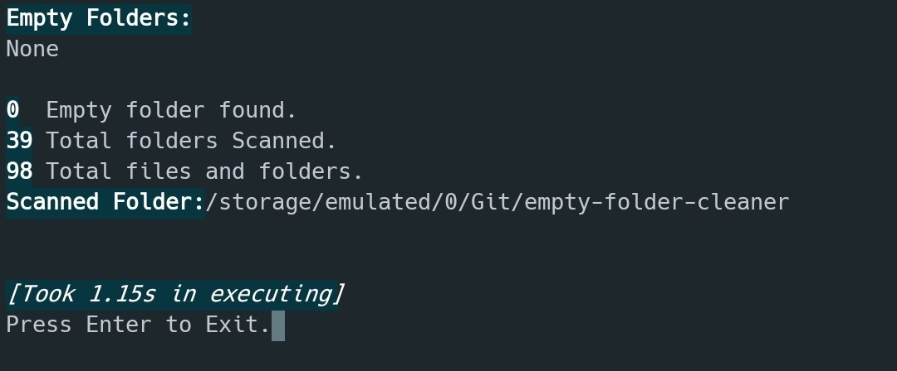
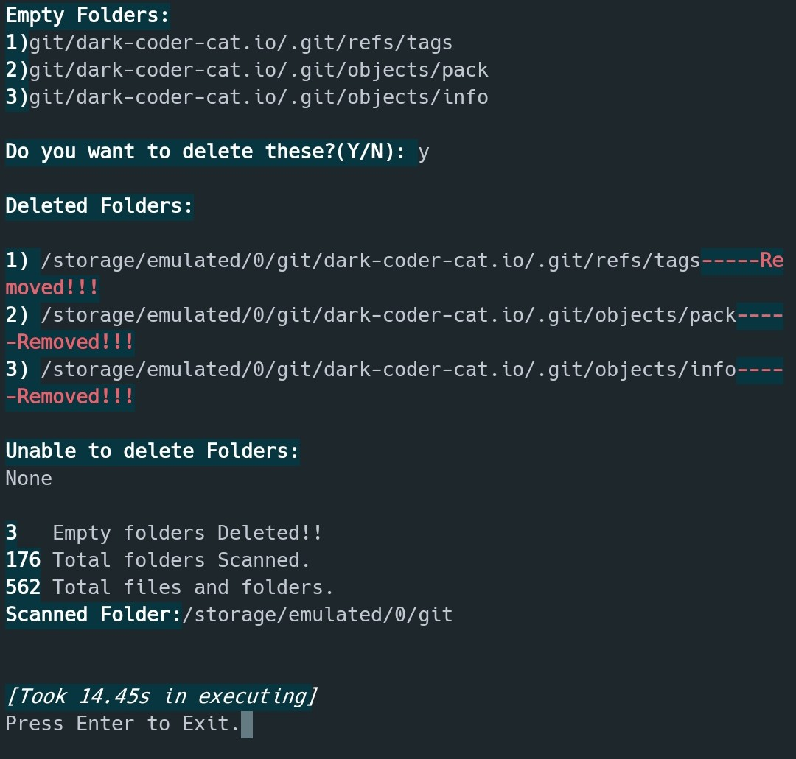

# Empty Folder Cleaner

## Table Of Contents

- [Description](#description)
- [Libaries Used](#libaries-used)
- [Setup Instructions](#setup-instructions)

## Description

Empty Folder Cleaner is a program that deletes empty folders from your computer or device and removes clutter to improve performance. 

## Libaries Used

- [Time](https://docs.python.org/3/library/time.html)
- [OS](https://docs.python.org/3/library/os.html)
- [Platform](https://docs.python.org/3/library/platform.html)

## Setup instructions

There are no prerequisites; simply run the script. If you don't already have Python installed, you can get it [here](https://www.python.org/downloads/).
This script doesn't need any additional modules.
So you can run directly without any requirements other than Python itself(Duh.)
```cmd
cd Empty Folder Cleaner
python empty_folder_cleaner.py
```

## Detailed explanation of script

### This script has 3 options:   

- 1 Check the empty folders in curent path
- 2 Check the empty folder in given path by user
- 3 **This is important** See **NOTE**
    > it is used to change the text color. but on some computers dosen't works.
- Or write "exit" at any input for exiting.
- After using opt. 1 or 2 you will be asked to enter (Y/N) if you want to delete the Folders
- At end it would display 
     - `the no. of folder deleted`
     - `the no. of folders scanned`
     - `the no. of files and folders present.`
     - `Scanned dir path` 

## NOTE 

> **If getting any code like `03m[` on terminal then choose OPTION 3 in starting**

## Output 

<table >
  <tr>
    <td colspan=2 align=center>Starting Screen↙↘ </td>
  </tr>
  <tr>
    <td rowspan=2>Option 1</td>
    <td>Option 2</td>
  </tr>
  <tr>
    <td>Process</td>
  </tr>
  <tr>
    <td colspan=2 align=center>↙if↘</td>
  </tr>
  <tr>
    <td>Found Empty Folders</td>
    <td>Not Found Empty Folders</td>
  </tr>
  <tr>
    <td colspan=2 align=center>↘↙</td>
  </tr>
  <tr>
    <td colspan=2 align=center>End Screen</td>
  </tr>
</table>

## Developer

[Dark Coder Cat | Vansh](https://github.com/dark-coder-cat)